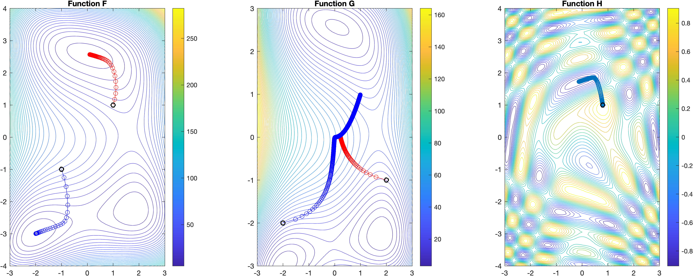
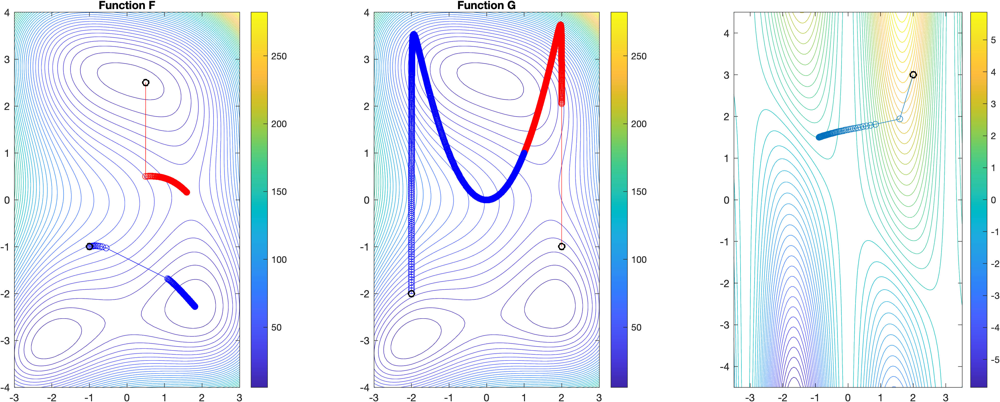
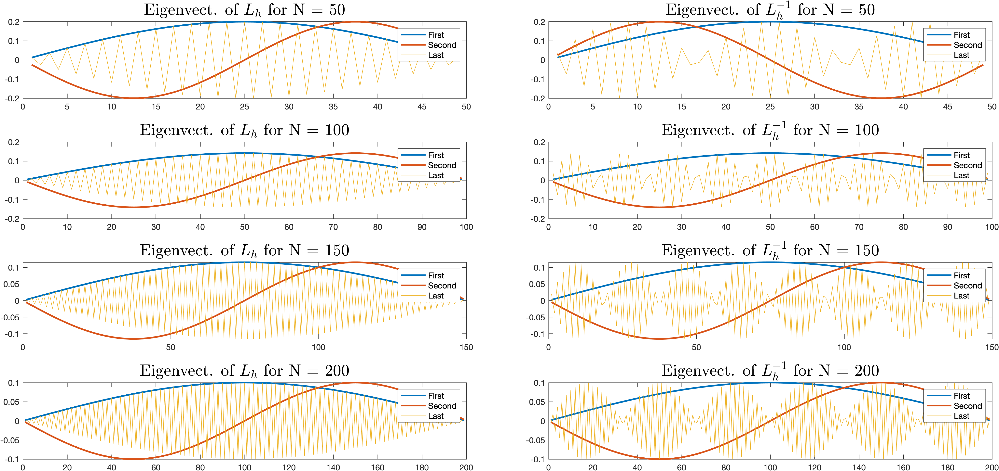
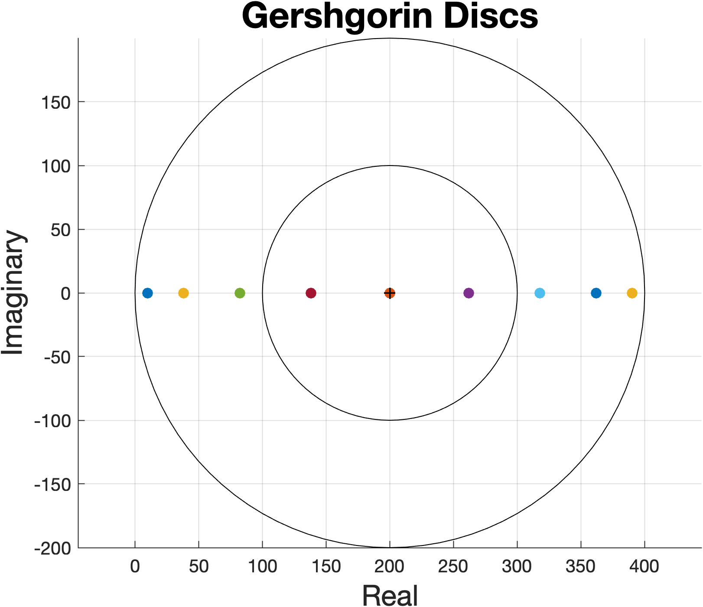

# Solution and Optimisation of large-scale problems

## Assignment 1 - Minimise the Himmelblau and Rosenbrock functions 

### Gradient Descent
Implement the gradient descent to minimise the Himmelblau and Rosenbrock functions. Plot the energy landscape and the path followed by the optimiser, with a black dot as the starting point. Further, generalise the algorithm using Matlabs symbolic toolbox, using symbolic computation to compute gradients of a third function. The respective contour plots are pictured below:

### Newton Method
Implement the Newton method to minimise the Himmelblau and Rosenbrock functions. Plot the energy landscape and the path followed by the optimiser, with a black dot as the starting point. Further, generalise the algorithm using Matlabs symbolic toolbox, using symbolic computation to compute gradients of a third function. The respective contour plots are pictured below:

## Assignment 2 - Finite-Difference, Jacobi and Gauss-Seidel solvers, Two-level multi-grid method

### 1D Laplace equation
Discretise the Laplace Equation by using the finite difference stencil, so that we express the discrete problem as a linear system of equations: Lh*u = f (where Lh is the discrete Laplacian operator). 

- Consider a discretisation of N equidistant intervals, where h = N1 and the first and last elements of u are the boundary conditions: u1 = uN+1 = 0 and u2 ... uN are the unknowns.
- Plot the first and last eigenvectors of Lh and its inverse and discuss  the behaviour for different mesh sizes h. How does the spectrum behave as h goes to 0?

- Consider the Gershgorin circle theorem. Write a Matlab script that plots the Gershgorin circles and shows that all eigenvalues lie inside one of these circles.

The Gershgorin discs allow us to estimate where the eigenvalues of the matrix Lh might be, i.e., it gives us a range for the eigenvalues. Each eigenvalue is plotted in a different colour. For N = 10 we have 10 discs in total. Since the matrix is symmetric, i.e., the sum of the off-diagonal entries is same for every row (except first and last), the radii are also the same. Therefore we get two overlapping circles with radius 100, and 8 overlapping circles with radius 200.

### Iterative linear solvers
Implement the Jacobi and the Gauss-Seidel methods for solving a linear system of equations (element-wise, without using the vectorial operator from Matlab). 

- Test the Jacobi and the Gauss-Seidel methods with the problem from Exercise 1 for a finite number of steps and different sizes of Lh by using a null vector as initial guess (u0 = 0).
- Plot the norm of the residuals as a function of the steps.
- In a separate chart plot the evolution of the error ek = u − uk as a function of x. Which smoother converges faster?

### Two-level multi-grid method
Implement a two-level mutli-grid solver, where:
- In the fine level you use the Jacobi and/or the Gauss-Seidel smoother
- In the coarse level you use a direct solver, e.g. the backslash operator from Matlab.
Make your implementation as general as possible, so you are able to change smoother on the fly.
- Test the two-level multi-grid method with the model problem from Exercise 1 by using both the Jacobi and the Gauss-
Seidel methods as a smoother. Plot the norm of the residuals and errors as a function of the steps in separate charts.